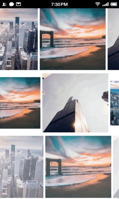
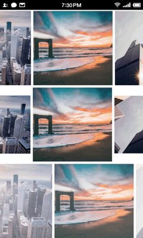

# ScrollParallaxImageView

ScrollParallaxImageView extends ImageView, and provides parallax effects when it scrolls in the screen.It can be use in any view which can scroll its content, like ListView, RecyclerView, ScrollView, etc.

## ScreenShots








## Include ScrollParallaxImageView to Your Project

With gradle:

```groovy
dependencies {
   compile 'com.gjiazhe:scrollparallaximageview:1.0'
}
```

## Use ScrollParallaxImageView in Layout File Just Like ImageView

```xml
<com.gjiazhe.scrollparallaximageview.ScrollParallaxImageView
    android:id="@+id/img"
    android:layout_width="match_parent"
    android:layout_height="180dp"
    android:src="@drawable/pic1"
    android:scaleType="centerCrop" />
```

## Set the Parallax Style in Java Code

```java
ScrollParallaxImageView iv = (ScrollParallaxImageView) findViewById(R.id.img);
iv.setParallaxStyles(new VerticalMovingStyle()); // or other parallax styles
```

There are several Parallax Styles in the library, but you can also custom  yourself.  Just create a class implements the interface `ScrollParallaxImageView.ParallaxStyle` :

```java
public class MyParallaxStyle implements ScrollParallaxImageView.ParallaxStyle {
  @Override
    public void transform(ScrollParallaxImageView view, Canvas canvas, int x, int y) {
        // Transform the view here, x and y stands for the coordinate of
        // ScrollParallaxImageView's top-left corner.
    }
  
    @Override
    public void onAttachedToImageView(ScrollParallaxImageView view) {
		// Do something when the style is set to a ScrollParallaxImageView.
    }

    @Override
    public void onDetachedFromImageView(ScrollParallaxImageView view) {
		// Do something when the style is remove from a ScrollParallaxImageView.
    }
}
```

## License

    MIT License

    Copyright (c) 2016 郭佳哲

    Permission is hereby granted, free of charge, to any person obtaining a copy
    of this software and associated documentation files (the "Software"), to deal
    in the Software without restriction, including without limitation the rights
    to use, copy, modify, merge, publish, distribute, sublicense, and/or sell
    copies of the Software, and to permit persons to whom the Software is
    furnished to do so, subject to the following conditions:
    
    The above copyright notice and this permission notice shall be included in all
    copies or substantial portions of the Software.
    
    THE SOFTWARE IS PROVIDED "AS IS", WITHOUT WARRANTY OF ANY KIND, EXPRESS OR
    IMPLIED, INCLUDING BUT NOT LIMITED TO THE WARRANTIES OF MERCHANTABILITY,
    FITNESS FOR A PARTICULAR PURPOSE AND NONINFRINGEMENT. IN NO EVENT SHALL THE
    AUTHORS OR COPYRIGHT HOLDERS BE LIABLE FOR ANY CLAIM, DAMAGES OR OTHER
    LIABILITY, WHETHER IN AN ACTION OF CONTRACT, TORT OR OTHERWISE, ARISING FROM,
    OUT OF OR IN CONNECTION WITH THE SOFTWARE OR THE USE OR OTHER DEALINGS IN THE
    SOFTWARE.

